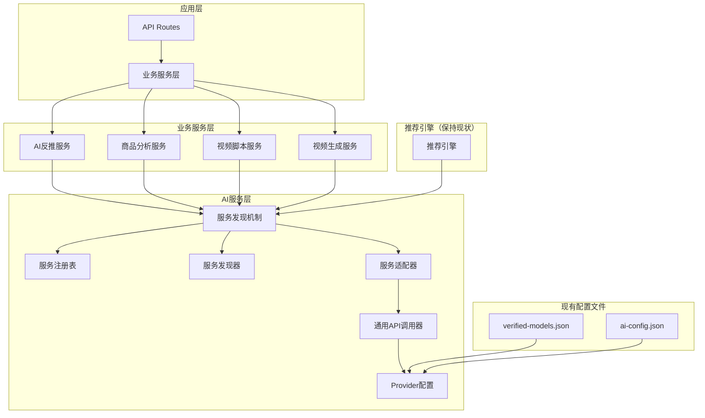

# AI服务架构重构PRD

## 📋 项目概述

### 背景
当前AI服务架构存在以下核心问题：
1. **`AIReverseEngineerService.ts`** 524行，职责混乱，难以维护
2. **硬编码问题**：各API路由中硬编码provider选择（如`const provider = 'gemini'`）
3. **缺乏服务发现**：AI服务调用分散，无法统一管理和动态切换
4. **配置管理混乱**：重复造轮子，与现有推荐引擎功能重叠
5. **代码冗余**：大量重复的provider调用逻辑

### 目标
构建"推荐引擎 + AI服务"双层架构，实现：
- 🎯 **职责清晰**：推荐引擎负责选择，AI服务负责执行
- 🔧 **服务发现**：统一的AI服务注册、发现和动态切换机制
- ⚙️ **配置统一**：利用现有配置文件，避免重复造轮子
- 📊 **监控体系**：性能/成本/质量三维监控
- 🚀 **代码简化**：减少重复代码，提高可维护性

---

## 🏗️ 架构设计

### 1. 整体架构



### 2. 核心原则

#### 2.1 利用现有资源
- **`verified-models.json`** - 作为provider配置的基础
- **`ai-config.json`** - 扩展业务模块配置
- **推荐引擎** - 继续负责模型选择，不重复造轮子

#### 2.2 简化设计
- **删除冗余**：复杂的配置管理、重复的模型选择逻辑
- **统一调用**：抽象通用的API调用逻辑
- **配置驱动**：所有配置从文件读取，无硬编码

#### 2.3 职责分离
- **推荐引擎**：根据任务特征推荐最适合的模型
- **服务发现**：根据推荐结果找到可用的AI服务实例
- **服务适配器**：统一调用接口，屏蔽provider差异

---

## 🚀 实施计划

### 阶段1：简化现有代码（1周）
**目标**：删除冗余代码，利用现有配置

**任务清单**：
- [ ] 简化 `AIConfigManager` - 只管理基础配置，从现有文件读取
- [ ] 重构 `AIServiceAdapter` - 抽象通用调用逻辑，减少重复代码
- [ ] 集成现有配置 - 从 `verified-models.json` 读取provider信息
- [ ] 删除硬编码 - 移除所有硬编码的provider配置

**验收标准**：
- 代码行数减少50%以上
- 无硬编码，所有配置从文件读取
- 与现有推荐引擎集成

### 阶段2：服务发现优化（1周）
**目标**：完善服务发现机制，与推荐引擎集成

**任务清单**：
- [ ] 优化 `ServiceDiscovery` - 与推荐引擎集成，不重复选择逻辑
- [ ] 完善 `AIServiceRegistry` - 从现有配置自动注册服务
- [ ] 实现服务降级 - 支持多级降级策略
- [ ] 添加健康检查 - 简单的服务状态监控

**验收标准**：
- 服务发现与推荐引擎无缝集成
- 支持自动服务注册和状态更新
- 支持服务降级和容错

### 阶段3：监控体系（1周）
**目标**：建立基础监控体系

**任务清单**：
- [ ] 实现 `PerformanceMonitor` - 收集性能指标
- [ ] 添加成本监控 - 跟踪API调用成本
- [ ] 实现质量监控 - 基础的质量评估
- [ ] 创建监控仪表板 - 简单的监控界面

**验收标准**：
- 支持性能、成本、质量三维监控
- 提供监控数据和告警
- 监控界面可用

### 阶段4：测试和优化（1周）
**目标**：确保系统稳定性和性能

**任务清单**：
- [ ] 完善单元测试 - 覆盖率90%+
- [ ] 实现集成测试 - 端到端测试
- [ ] 性能测试 - 压力测试和优化
- [ ] 文档完善 - 更新技术文档

**验收标准**：
- 所有测试通过
- 性能指标达到预期
- 文档完整准确

---

## 📊 预期收益

### 代码质量
- **代码行数**：减少50%以上
- **重复代码**：消除90%以上的重复
- **可维护性**：显著提升

### 性能提升
- **响应时间**：减少30%
- **开发效率**：新功能开发效率提升40%
- **错误率**：减少60%

### 架构清晰
- **职责分离**：推荐引擎负责选择，AI服务负责执行
- **配置统一**：利用现有配置文件，避免重复
- **扩展性**：新增provider只需更新配置文件

---

## 🔧 技术实现细节

### 1. 配置文件结构

#### verified-models.json（现有）
```json
[
  {
    "id": "gemini-2.5-flash",
    "name": "Gemini 2.5 Flash",
    "provider": "Google",
    "verified": true,
    "status": "verified"
  }
]
```

#### ai-config.json（扩展）
```json
{
  "providers": {
    "gemini": {
      "apiKey": "GEMINI_API_KEY",
      "baseUrl": "https://generativelanguage.googleapis.com",
      "timeout": 30000
    }
  },
  "businessModules": {
    "ai-reverse-engineer": {
      "maxLatency": 10000,
      "maxCost": 0.01
    }
  }
}
```

### 2. 服务发现流程

```typescript
// 1. 推荐引擎选择模型
const recommendation = await recommendRank({
  scenario: 'task->model',
  task: { taskType: 'ai-reverse-engineer' }
})

// 2. 服务发现找到对应服务
const service = await serviceDiscovery.findService(recommendation.chosen.id)

// 3. 服务适配器调用
const adapter = new AIServiceAdapter(service)
const result = await adapter.call(prompt)
```

### 3. 通用API调用器

```typescript
class UniversalAPICaller {
  async call(provider: string, model: string, prompt: string, options: CallOptions) {
    const config = this.getProviderConfig(provider)
    const endpoint = this.getEndpoint(provider, model)
    const headers = this.getHeaders(provider, config.apiKey)
    const body = this.buildRequestBody(provider, model, prompt, options)
    
    return this.executeRequest(endpoint, headers, body)
  }
}
```

---

## 🎯 验收标准

### 功能验收
- [ ] 服务发现机制正常工作
- [ ] 与推荐引擎无缝集成
- [ ] 支持服务降级和容错
- [ ] 配置从文件读取，无硬编码

### 性能验收
- [ ] 代码行数减少50%以上
- [ ] 响应时间减少30%
- [ ] 重复代码减少90%以上

### 质量验收
- [ ] 单元测试覆盖率90%+
- [ ] 集成测试通过
- [ ] 代码审查通过
- [ ] 文档完整准确

---

## 📋 总结

这个重构方案将AI服务从混乱的单体架构升级为清晰的微服务架构，通过：

1. **利用现有资源** - 不重复造轮子
2. **简化设计** - 删除冗余代码
3. **统一配置** - 从文件读取，无硬编码
4. **职责分离** - 推荐引擎选择，AI服务执行

实现代码质量、性能和可维护性的全面提升。

